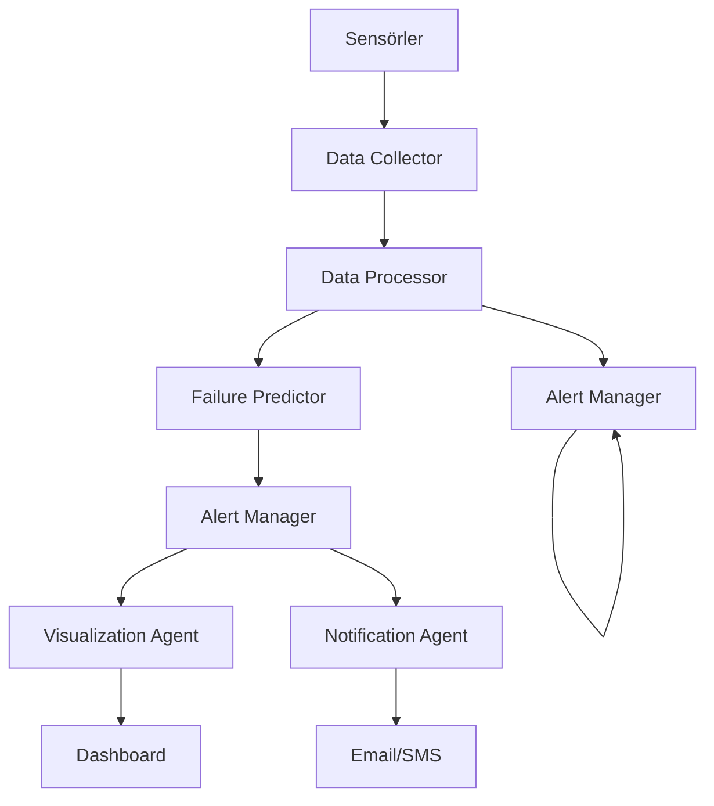

# 🤖 AI Agents Architecture
# SmartEnergy - Akıllı Ajanlar Mimarisi

## Genel Bakış

SmartEnergy sistemi, birbirleriyle koordineli çalışan çoklu AI ajanlarından oluşur. Her ajan belirli bir sorumluluğa sahiptir ve microservices architecture prensiplerine göre tasarlanmıştır.

## Ajan Mimarisi


Temel Ajanlar
1. Data Collector Agent
Sorumluluk: Çoklu kaynaklardan veri toplama ve birleştirme

python
class DataCollectorAgent:
    def __init__(self):
        self.protocols = ['OPC_UA', 'MQTT', 'Modbus']
        self.buffer_size = 10000
        
    async def collect_opcua_data(self, endpoint, nodes):
        """OPC UA sunucusundan veri toplama"""
        pass
        
    async def collect_mqtt_data(self, broker, topics):
        """MQTT broker'dan veri subscribe etme"""
        pass
        
    def validate_data_quality(self, data):
        """Veri kalite metriğini hesaplama"""
        pass
        ```
        
Konfigürasyon:

```
data_collector:
  opcua_endpoint: "opc.tcp://localhost:4840"
  mqtt_broker: "tcp://localhost:1883"
  sampling_interval: 5000  # ms
  buffer_size: 10000
2. Data Processor Agent
Sorumluluk: Ham veriyi temizleme, ön işleme ve feature extraction

```
class DataProcessorAgent:
    def __init__(self):
        self.pipeline = self.create_processing_pipeline()
    
    def create_processing_pipeline(self):
        """Veri işleme pipeline'ını oluştur"""
        return [
            'handle_missing_values',
            'remove_outliers',
            'normalize_data',
            'extract_features',
            'create_rolling_features'
        ]
    
    def extract_features(self, data):
        """Zaman serisi feature'ları çıkar"""
        features = {
            'rolling_mean_1h': data.rolling('1h').mean(),
            'rolling_std_1h': data.rolling('1h').std(),
            'rate_of_change': data.diff().abs(),
            'seasonal_trend': self.extract_seasonality(data)
        }
        return features

```
```
3. Anomaly Analyzer Agent
Sorumluluk: Anormal davranışları tespit ve sınıflandırma

```
class AnomalyAnalyzerAgent:
    def __init__(self):
        self.models = {
            'isolation_forest': IsolationForest(contamination=0.1),
            'autoencoder': self.build_autoencoder(),
            'statistical': StatisticalThresholdModel()
        }
    
    def detect_anomalies(self, features):
        """Çoklu model ile anomali tespiti"""
        scores = {}
        for name, model in self.models.items():
            scores[name] = model.predict(features)
        
        # Ensemble voting
        final_score = self.ensemble_voting(scores)
        return final_score
    
    def classify_anomaly_type(self, anomaly_data):
        """Anomali tipini sınıflandır"""
        anomaly_types = {
            'spike': 'Ani yükselme/düşüş',
            'drift': 'Yavaş trend değişimi',
            'noise': 'Yüksek varyans',
            'missing': 'Veri kaybı'
        }
        return self.predict_anomaly_type(anomaly_data)
```
4. Failure Predictor Agent
Sorumluluk: Makine arızasını önceden tahmin etme

```
class FailurePredictorAgent:
    def __init__(self):
        self.models = {
            'short_term': LSTM_model(),
            'long_term': RandomForest_model(),
            'ensemble': EnsembleModel()
        }
        self.prediction_horizon = 72  # saat
    
    def predict_failure_risk(self, historical_data, real_time_data):
        """Arıza risk skoru hesapla"""
        # Feature engineering
        features = self.prepare_features(historical_data, real_time_data)
        
        # Multi-model prediction
        predictions = {}
        for horizon in [24, 48, 72]:  # saat
            predictions[horizon] = self.ensemble_predict(features, horizon)
        
        return self.calculate_risk_score(predictions)
    
    def calculate_risk_score(self, predictions):
        """Tahminleri risk skoruna dönüştür"""
        weights = {24: 0.3, 48: 0.5, 72: 0.2}
        weighted_score = sum(predictions[h] * weights[h] for h in predictions)
        return min(100, weighted_score * 100)
```
5. Alert Manager Agent
Sorumluluk: Uyarı yönetimi ve bildirim gönderme

```
class AlertManagerAgent:
    def __init__(self):
        self.alert_rules = self.load_alert_rules()
        self.notification_channels = ['email', 'sms', 'webhook']
    
    def evaluate_alerts(self, anomaly_score, risk_score):
        """Uyarı koşullarını değerlendir"""
        alerts = []
        
        if anomaly_score > 0.8:
            alerts.append(self.create_alert('CRITICAL_ANOMALY', anomaly_score))
        
        if risk_score > 80:
            alerts.append(self.create_alert('HIGH_FAILURE_RISK', risk_score))
        
        return alerts
    
    def create_alert(self, alert_type, score):
        """Yapılandırılmış uyarı oluştur"""
        return {
            'id': str(uuid.uuid4()),
            'type': alert_type,
            'severity': self.calculate_severity(score),
            'timestamp': datetime.now(),
            'score': score,
            'message': self.get_alert_message(alert_type, score),
            'actions': self.get_recommended_actions(alert_type)
        }
```
6. Visualization Agent
Sorumluluk: Veri görselleştirme ve dashboard güncelleme

```
class VisualizationAgent:
    def __init__(self):
        self.dashboards = {
            'main': GrafanaDashboard(),
            'mobile': MobileDashboard(),
            'kpi': KPIDashboard()
        }
    
    def update_dashboards(self, processed_data, alerts, predictions):
        """Tüm dashboard'ları güncelle"""
        for name, dashboard in self.dashboards.items():
            dashboard.update({
                'real_time_metrics': processed_data,
                'active_alerts': alerts,
                'risk_predictions': predictions,
                'system_health': self.get_system_health()
            })
    
    def generate_reports(self, period='daily'):
        """Otomatik rapor generation"""
        report_data = self.collect_report_data(period)
        return self.format_report(report_data, period)

```
Ajan İletişim Protokolü
Mesaj Formatı
```
{
    "message_id": "uuid",
    "sender": "agent_name",
    "receiver": "target_agent",
    "timestamp": "2024-01-01T10:00:00Z",
    "type": "data|alert|command|response",
    "priority": "low|medium|high|critical",
    "payload": {...},
    "correlation_id": "optional_context_id"
}
```
Event Types
```
event_types:
  DATA_RECEIVED:
    description: "Yeni sensör verisi alındı"
    payload: {"sensor_data": [...], "metadata": {...}}
  
  ANOMALY_DETECTED:
    description: "Anomali tespit edildi"
    payload: {"anomaly_score": 0.95, "features": [...], "type": "spike"}
  
  RISK_PREDICTION:
    description: "Arıza risk tahmini güncellendi"
    payload: {"risk_score": 85, "confidence": 0.92, "horizon_hours": 48}
  
  ALERT_TRIGGERED:
    description: "Yeni uyarı oluşturuldu"
    payload: {"alert": {...}, "notifications": [...]}
```
Konfigürasyon Yönetimi
Ajan Konfigürasyonu
```
agents:
  data_collector:
    enabled: true
    resources:
      cpu_limit: "1.0"
      memory_limit: "512Mi"
    health_check:
      interval: 30s
      timeout: 10s
  
  anomaly_analyzer:
    enabled: true
    models:
      isolation_forest:
        contamination: 0.1
        n_estimators: 100
      autoencoder:
        encoding_dim: 32
        epochs: 50
    
  failure_predictor:
    prediction_horizons: [24, 48, 72]
    model_retraining:
      interval: "7d"
      trigger: "performance_drop"
```
Monitoring ve Logging
Health Monitoring
```
class AgentHealthMonitor:
    def check_agent_health(self, agent_name):
        metrics = {
            'cpu_usage': self.get_cpu_usage(agent_name),
            'memory_usage': self.get_memory_usage(agent_name),
            'message_queue': self.get_queue_length(agent_name),
            'last_activity': self.get_last_activity(agent_name),
            'error_rate': self.get_error_rate(agent_name)
        }
        return self.calculate_health_score(metrics)
```
Performans Metrikleri
```
performance_metrics = {
    'data_processing_latency': 'histogram',
    'model_inference_time': 'histogram', 
    'alert_detection_time': 'histogram',
    'system_throughput': 'counter',
    'error_count': 'counter'
}
```
Scaling Stratejisi
Horizontal Scaling
```
scaling:
  data_collector:
    min_replicas: 2
    max_replicas: 10
    metrics:
      - type: Resource
        resource:
          name: cpu
          target:
            type: Utilization
            averageUtilization: 70
  
  anomaly_analyzer:
    min_replicas: 1  
    max_replicas: 5
    metrics:
      - type: Pods
        pods:
          metric:
            name: processing_queue_length
          target:
            type: AverageValue
            averageValue: 1000

```
Bu ajan mimarisi, sistemin modüler, ölçeklenebilir ve bakımı kolay olmasını sağlar. Her ajan bağımsız olarak deploy edilebilir, scale edilebilir ve monitor edilebilir.
